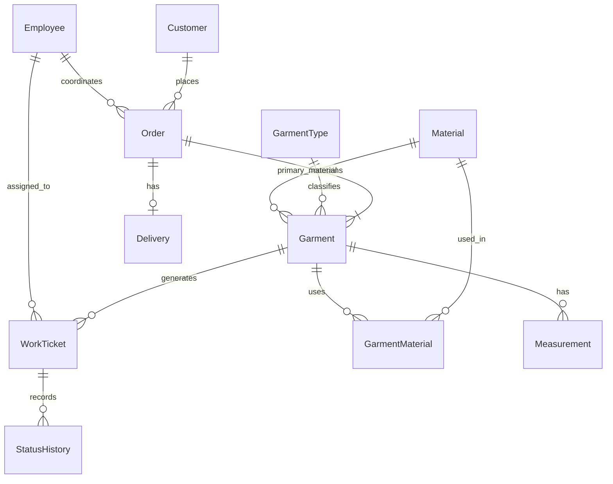

# ERD

```mermaid
erDiagram
    Customer ||--o{ Order : places
    Employee ||--o{ Order : coordinates
    Order ||--|{ Garment : contains
    GarmentType ||--o{ Garment : classifies
    Material ||--o{ Garment : primary_material
    Garment ||--o{ WorkTicket : generates
    WorkTicket ||--o{ StatusHistory : records
    Employee ||--o{ WorkTicket : assigned_to
    Order ||--o| Delivery : has
    Material ||--o{ GarmentMaterial : used_in
    Garment ||--o{ GarmentMaterial : uses
    Garment ||--o{ Measurement : has
```

This ERD aligns with the Django model schema and normalization notes in `docs/database_design.md`.
